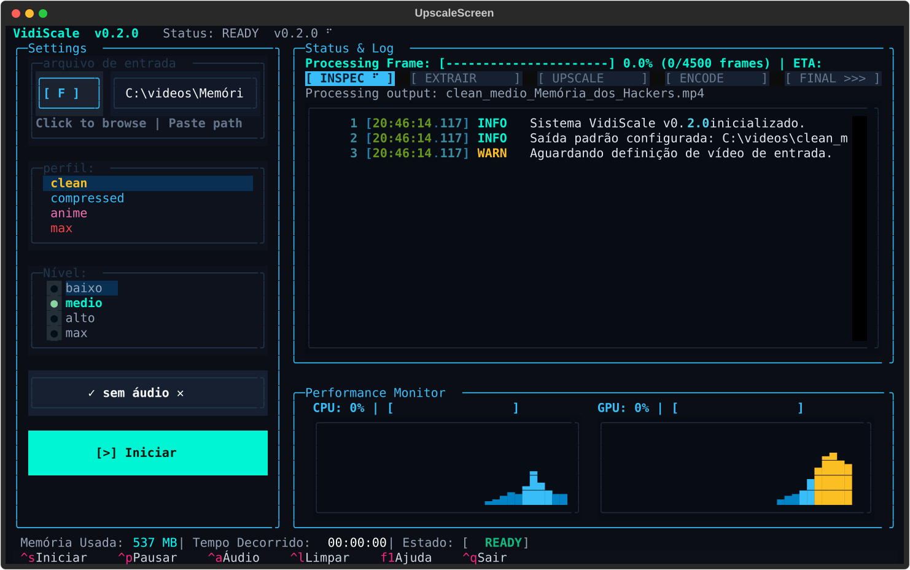

<h1 align="center">Welcome to upscale-video 👋</h1>

<p align="center">
  <a href="https://github.com/mattheusbr/upscale-video"></a>
  =3.12-3776AB.svg?logo=python&logoColor=white" alt="python">
  
  
  
  <a href="LICENSE"></a>
</p>

<p align="center">
  <strong>English</strong> • <a href="README.pt-BR.md">Português (Brasil)</a>
</p>

> Local, quality-first video upscaling pipeline powered by Real-ESRGAN, CUDA hardware acceleration, and an interactive cyberpunk terminal UI (VidiScale).

<p align="center">
  
</p>

---

### 🏠 Homepage
[https://github.com/mattheusbr/upscale-video](https://github.com/mattheusbr/upscale-video)

### Prerequisites
- **OS**: Windows 10/11 (64-bit)
- **GPU**: NVIDIA GPU with CUDA support
- **Python**: `>= 3.12`
- **Git**: Git with submodule support enabled

### Install
Clone the repository recursively with all submodules and run the automated bootstrap script:

```powershell
git clone --recurse-submodules https://github.com/mattheusbr/upscale-video.git
cd upscale-video
.\scripts\bootstrap.ps1
```

Confirm that all system dependencies and GPU drivers are ready:
```powershell
.\.venv\Scripts\python.exe -m upscaler doctor
```

### Build the Windows executable
With Python 3.12 installed and the Real-ESRGAN submodule initialized, build the distributable with:
```powershell
git submodule update --init --recursive
.\scripts\build_exe.ps1
```
The output is in `dist\upscale\`. Distribute the **entire folder**, not just `upscale.exe` — it contains the CUDA runtime, models, Real-ESRGAN, and FFmpeg.

```powershell
.\dist\upscale\upscale.exe tui
.\dist\upscale\upscale.exe video.mp4
.\dist\upscale\upscale.exe doctor
```

### Usage

#### 🖥️ Interactive Terminal UI (TUI)
Launch the cyberpunk dashboard with real-time GPU/CPU telemetry and interactive video controls:
```powershell
.\.venv\Scripts\python.exe -m upscaler tui
```
*(Optionally preload a video: `.\.venv\Scripts\python.exe -m upscaler tui --input video.mp4`)*

#### ⚡ Quick Start CLI (Simple Mode)
```powershell
# Upscale with default settings (profile: clean, level: medio / 1080p)
.\.venv\Scripts\python.exe -m upscaler input.mp4

# Custom profile and resolution level
.\.venv\Scripts\python.exe -m upscaler input.mp4 --profile max --nivel alto

# Run quick benchmark preview before full video processing
.\.venv\Scripts\python.exe -m upscaler simple input.mp4 --profile clean --benchmark
```

#### 🎛️ Profiles & Levels

| Profile | AI Model | Best For |
| :--- | :--- | :--- |
| `clean` *(default)* | `RealESRGAN_x4plus` | Real-world footage, live-action content |
| `compressed` | `realesr-general-x4v3` | Videos with artifacts and compression noise |
| `anime` | `realesr-animevideov3` | 2D animation, cartoons, digital artwork |
| `max` | `RealESRGAN_x4plus` | Maximum detail fidelity (heavy compute) |

| Level (`--nivel`) | Max Dimension | Target Resolution |
| :--- | :--- | :--- |
| `baixo` | 1280 px | 720p HD |
| `medio` *(default)* | 1920 px | 1080p Full HD |
| `alto` | 3840 px | 4K UHD |
| `max` | 4x native | Pure 4x model inference |

#### 🔧 Advanced CLI Mode
```powershell
.\.venv\Scripts\python.exe -m upscaler run input.mp4 output.mp4 --profile clean --tile 256 --preset slow --crf 17
```

### Run tests
```powershell
.\.venv\Scripts\python.exe -m unittest discover tests
```

### Author
👤 **Matheus Bruno**
- GitHub: [@mattheusbr](https://github.com/mattheusbr)

### 🤝 Contributing
Contributions, issues, and feature requests are welcome!  
Feel free to check the [issues page](https://github.com/mattheusbr/upscale-video/issues).

### Show your support
Give a ⭐️ if this project helped you!

### 📝 License
- **upscale-video**: This project is licensed under the [MIT License](LICENSE) © 2026 Matheus Bruno.
- **Real-ESRGAN fork**: The bundled [Real-ESRGAN fork](https://github.com/mattheusbr/Real-ESRGAN) submodule (upstream: [xinntao/Real-ESRGAN](https://github.com/xinntao/Real-ESRGAN)) is licensed under the [BSD 3-Clause License](vendor/Real-ESRGAN/LICENSE) © 2021 Xintao Wang.
